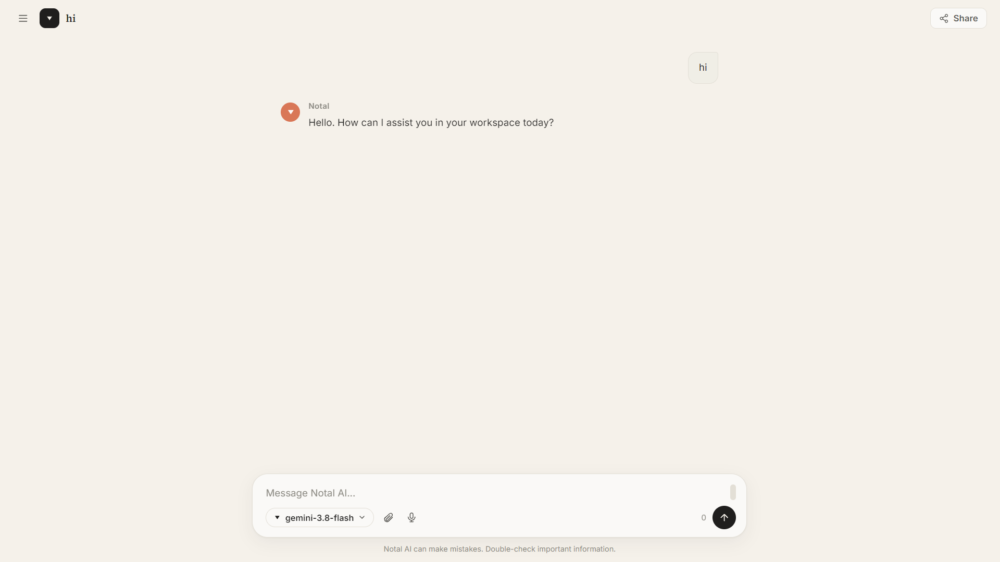
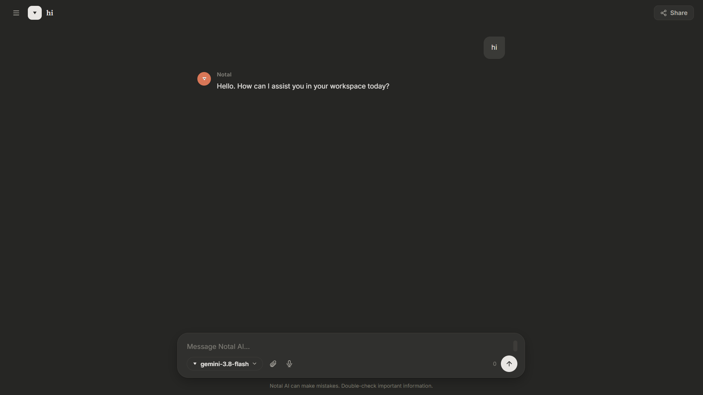
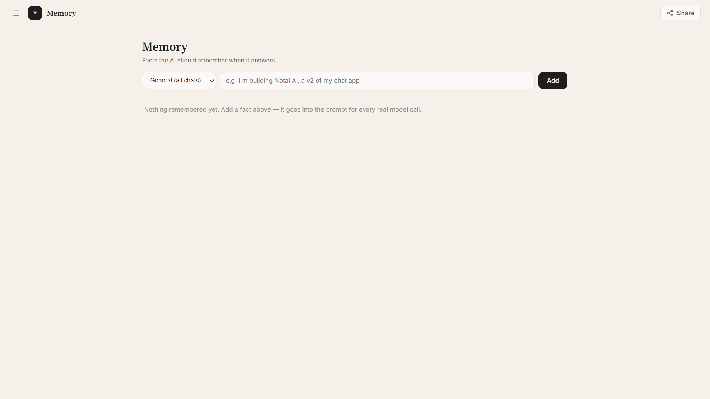
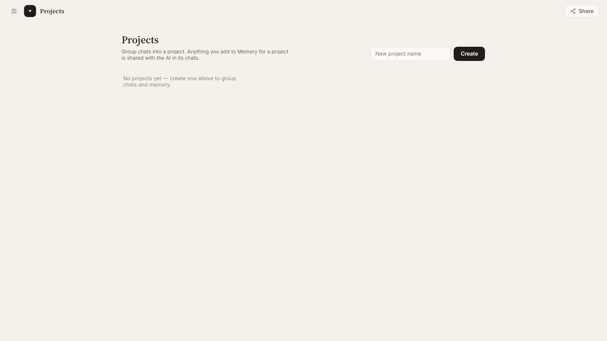
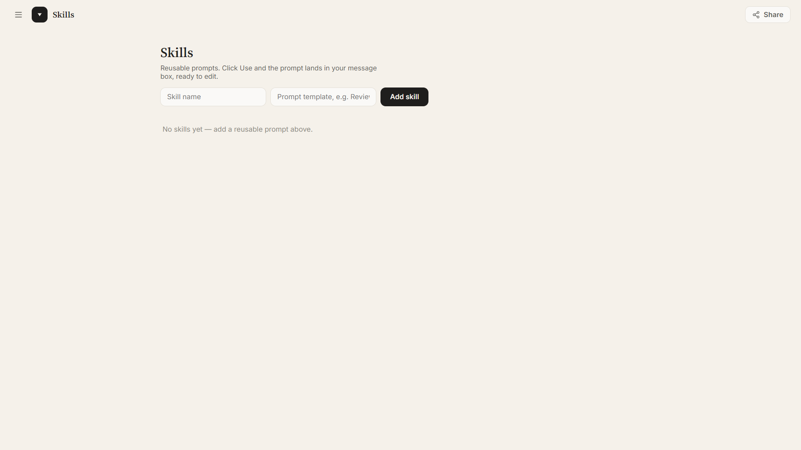

<div align="center">
  
  <h1>Notal AI Workspace</h1>
  <p><strong>Your intelligent AI workspace — memory, projects, skills, and multi-model chat.</strong></p>
  <p>
    <a href="https://batbleseed.github.io/notal-ai-ui/"><strong>🚀 Live Demo</strong></a> •
    <a href="#features"><strong>Features</strong></a> •
    <a href="#tech-stack"><strong>Tech Stack</strong></a> •
    <a href="#getting-started"><strong>Getting Started</strong></a>
  </p>
  <p>
    
    
    
    
  </p>
</div>

---

## 🧠 What is Notal AI Workspace?

**Notal AI Workspace** is a modern, client-first AI workspace that lets you:

- Chat with **10+ AI models** through one clean interface
- Build a **Memory** of facts the AI remembers across chats
- Organize conversations into **Projects**
- Save reusable prompts as **Skills**
- Switch between **Light** and **Dark** themes
- Lock the app behind a **PIN** for privacy
- Install it as a **PWA** on any device

It's a **power-user alternative** to Notal AI Chat — for people who want more control over how their AI thinks and remembers.

> Looking for the simpler, backend-powered chat? Check out [Notal AI Chat](https://notalai.qd.je/chat.html).

---

## ✨ Features

### 💬 Chat
- Multi-model support (GPT, Claude, Gemini, DeepSeek, Llama, and more)
- Markdown rendering with code blocks and copy buttons
- Streaming responses
- Chat history saved locally

### 🧠 Memory
- Add facts the AI should always remember
- Scope memories to **General** (all chats) or **specific Projects**
- Memory is injected into every real model call

### 📁 Projects
- Group chats and memory together
- Keep project-specific context isolated
- Shared memory within each project

### ⚡ Skills
- Save reusable prompt templates
- One-click insert into your message box
- Perfect for repeated workflows (e.g., "Review my code", "Summarize this")

### 🎨 Themes
- **Light** — Warm cream + burnt orange
- **Dark** — Sleek charcoal + terracotta
- Instant toggle in Settings

### 🔒 Security
- App lock with PIN
- Auto-lock on idle
- Clear all API keys in one click

### ⌨️ Keyboard Shortcuts
| Shortcut | Action |
|----------|--------|
| `Ctrl + K` | New chat |
| `Ctrl + Shift + F` | Search chats |
| `Ctrl + I` | Focus input |
| `Ctrl + B` | Toggle sidebar |
| `Ctrl + ,` | Open settings |
| `Ctrl + Shift + L` | Lock app |
| `Enter` | Send message |
| `Shift + Enter` | New line |
| `Esc` | Close menu / settings |

### 📱 PWA
- Installable on desktop and mobile
- Offline-capable shell
- Full-screen app experience
- Home screen icon

---

## 🛠 Tech Stack

| Layer | Tech |
|-------|------|
| **Frontend** | HTML, CSS, JavaScript (vanilla) |
| **UI** | Custom design system, dual-theme |
| **Backend** | Custom (server-side proxy for model calls) |
| **PWA** | Service worker + Web App Manifest |
| **Storage** | `localStorage` for chats, memory, projects, skills, settings |
| **Hosting** | GitHub Pages |

---

## 🚀 Getting Started

### Prerequisites
- A modern browser (Chrome, Edge, Firefox, Safari)
- An API key for at least one supported provider (if self-hosting)

### Installation

```bash
# Clone the repo
git clone https://github.com/batbleseed/notal-ai-ui.git
cd notal-ai-ui

# Open in browser (no build step required)
# Simply open index.html, or serve it:
python -m http.server 8000
```

Then visit `http://localhost:8000`.

### Adding API Keys
1. Open the app
2. Click your profile → **Settings**
3. Go to **Providers**
4. Paste your API keys for OpenAI, Anthropic, Google, OpenRouter, etc.
5. Keys are stored **only in your browser**

---

## 📸 Screenshots

> Add your own screenshots here!

| Light Mode | Dark Mode |
|------------|-----------|
|  |  |

| Memory | Projects | Skills |
|--------|----------|--------|
|  |  |  |

---

## 🧩 How It Works

```
┌─────────────────────────────────────────────┐
│              Notal AI Workspace             │
├─────────────────────────────────────────────┤
│  Sidebar            │       Chat Area       │
│  • Chats            │       • Messages      │
│  • Projects         │       • Streaming     │
│  • Memory           │       • Markdown      │
│  • Skills           │       • Code blocks   │
├─────────────────────────────────────────────┤
│           Message Input + Controls          │
└─────────────────────────────────────────────┘
        │
        ▼
┌─────────────────────────────────────────────┐
│             Custom Backend                  │
│  • Handles model routing                    │
│  • Injects Memory + Project context         │
│  • Streams responses                        │
└─────────────────────────────────────────────┘
        │
        ▼
┌─────────────────────────────────────────────┐
│     AI Providers (OpenAI, Anthropic,        │
│     Google, OpenRouter, DeepSeek, etc.)     │
└─────────────────────────────────────────────┘
```

---

## 🗺 Roadmap

- [x] Memory system
- [x] Projects
- [x] Skills
- [x] Dual themes
- [x] Full settings (General, Account, Providers, Notifications, Security, Shortcuts)
- [x] PWA support
- [x] Backend integration
- [ ] File uploads
- [ ] Voice input
- [ ] Live web search
- [ ] Image generation
- [ ] Export chat as Markdown

---

## 🤝 Contributing

Contributions, issues, and feature requests are welcome!

1. Fork the repo
2. Create a branch (`git checkout -b feature/amazing-feature`)
3. Commit your changes (`git commit -m 'Add amazing feature'`)
4. Push to your branch (`git push origin feature/amazing-feature`)
5. Open a Pull Request

---

## 📄 License

This project is licensed under the **MIT License** — see the [LICENSE](LICENSE) file for details.

---

## 👤 Author

**batbleseed**

- GitHub: [@batbleseed](https://github.com/batbleseed)
- Brand: **Notal AI**
- Live: [batbleseed.github.io/notal-ai-ui](https://batbleseed.github.io/notal-ai-ui/)

---

## 🙏 Acknowledgements

- All the AI providers making this possible
- The open-source community
- Everyone who tested the early builds

---

<div align="center">
  <sub>Built with ❤️ by batbleseed</sub>
  <br>
  <sub>⭐ If you like this project, give it a star!</sub>
</div>
person. MIT licensed — see [LICENSE](LICENSE).
